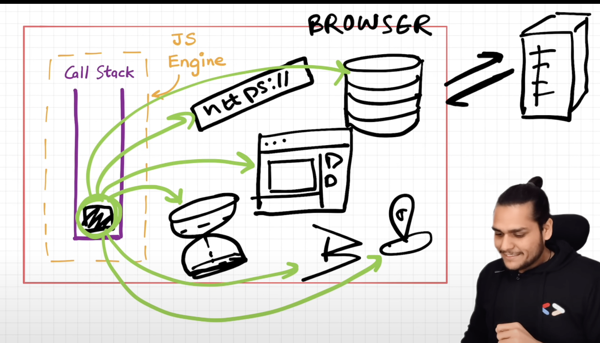
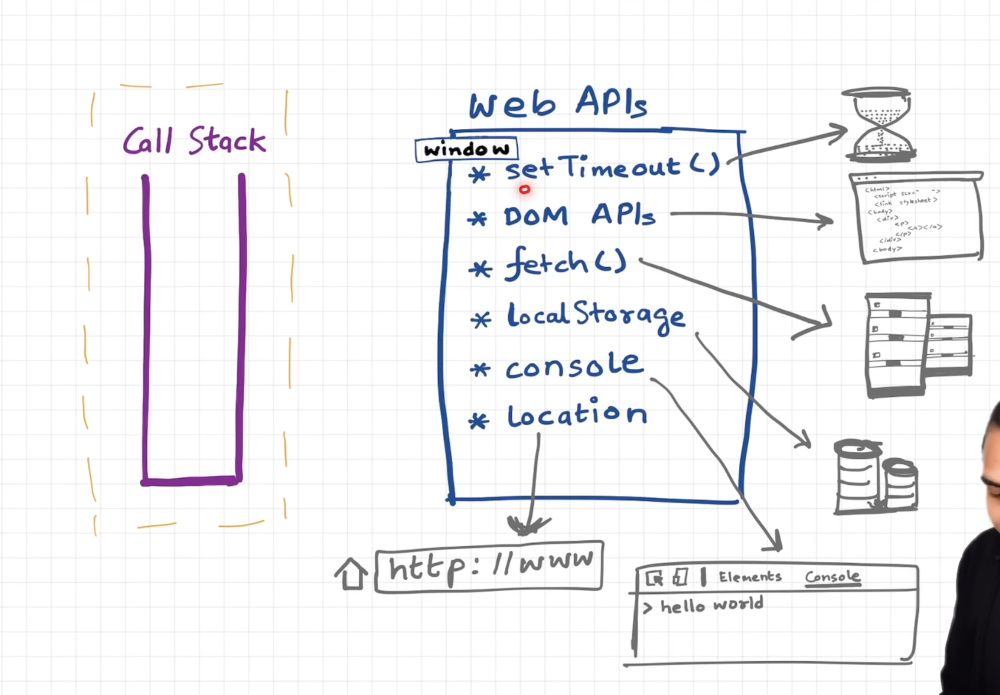
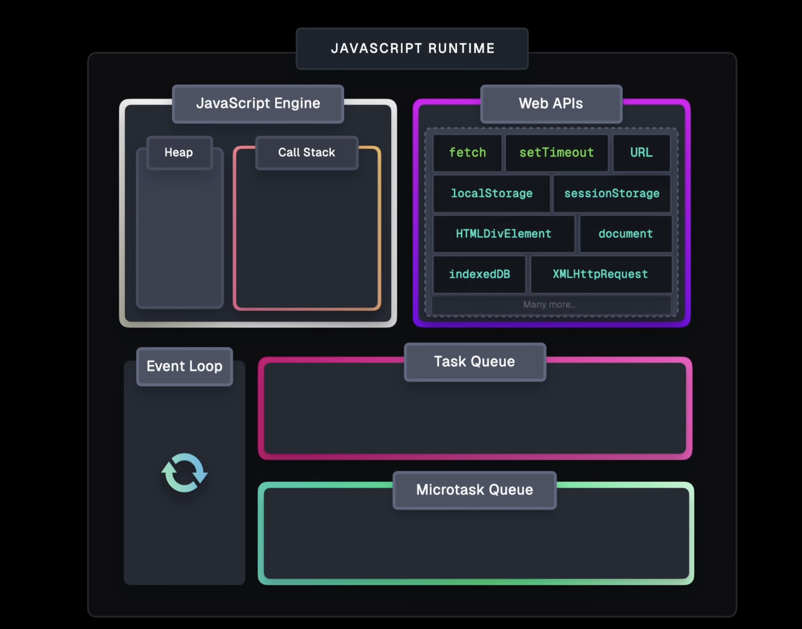
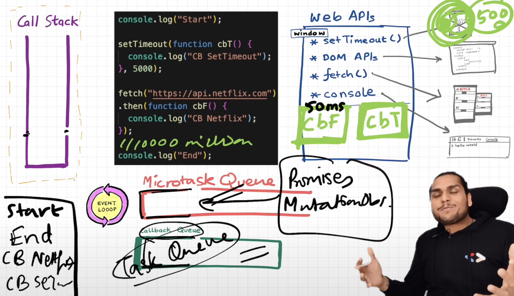

# iterators:

```js
function* fibonacci() {
  let current = 1;
  let next = 1;
  while (true) {
    yield current;
    [current, next] = [next, current + next];
  }
}

const seq = fibonacci();
const firstThreeDigitTerm = seq.find((n) => n >= 100);
```

You cannot convert seq to an array, because it is infinite. Instead, you can use the find() method of the iterator itself, which only iterates seq as far as necessary to find the first value that satisfies the condition.

# promise

- A Promise is an object representing the eventual completion or failure of an asynchronous operation.
- Essentially, a promise is a returned object to which you attach callbacks, instead of passing callbacks into a function.

## chaining:

- A common need is to execute two or more asynchronous operations back to back, where each subsequent operation starts when the previous operation succeeds, with the result from the previous step.

## error handling based on importance of any intermediate operations in the chain:

```js
doSomethingCritical()
  .then((result) =>
    doSomethingOptional(result)
      .then((optionalResult) => doSomethingExtraNice(optionalResult))
      .catch((e) => {})
  ) // Ignore if optional stuff fails; proceed.
  .then(() => moreCriticalStuff())
  .catch((e) => console.error(`Critical failure: ${e.message}`));
```

- The inner error-silencing catch handler only catches failures from `doSomethingOptional()` and `doSomethingExtraNice()`, after which the code resumes with `moreCriticalStuff()`. Importantly, if `doSomethingCritical()` fails, its error is caught by the final (outer) catch only, and does not get swallowed by the inner catch handler.
- In async/await, this code looks like:

```js
async function main() {
  try {
    const result = await doSomethingCritical();
    try {
      const optionalResult = await doSomethingOptional(result);
      await doSomethingExtraNice(optionalResult);
    } catch (e) {
      // Ignore failures in optional steps and proceed.
    }
    await moreCriticalStuff();
  } catch (e) {
    console.error(`Critical failure: ${e.message}`);
  }
}
```

- Note: If you don't have sophisticated error handling, you very likely don't need nested then handlers. Instead, use a flat chain and put the error handling logic at the end.

## Promise rejection events

If a promise rejection event is not handled by any handler, it bubbles to the top of the call stack, and the host needs to surface it. On the web, whenever a promise is rejected, one of two events is sent to the global scope. The two events are:
`unhandledrejection` - Sent when a promise is rejected but there is no rejection handler available.
`rejectionhandled` - Sent when a handler is attached to a rejected promise that has already caused an unhandledrejection event.

- How to handle unhandledrejection event in window object in the browser

```js
addEventListener("unhandledrejection", (event) => {});
onunhandledrejection = (event) => {}; // event has two properties, reason and promise
```

Example:

```js
window.addEventListener("unhandledrejection", (event) => {
  console.warn(`UNHANDLED PROMISE REJECTION: ${event.reason}`);
});
```

- how to handle in node.js:
  In Node.js, handling promise rejection is slightly different. You capture unhandled rejections by adding a handler for the Node.js unhandledRejection event (notice the difference in capitalization of the name), like this:

```js
process.on("unhandledRejection", (reason, promise) => {
  // Add code here to examine the "promise" and "reason" values
});
```

Example:

```js
function doSomething() {
  return new Promise((resolve) => {
    setTimeout(() => {
      // Other things to do before completion of the promise
      console.log("Did something");
      // The fulfillment value of the promise
      resolve("https://example.com/");
    }, 200);
  });
}

doSomething()
  .then(() => {
    throw new Error("Something failed");

    console.log("Do this");
  })
  //   .catch((err) => {
  //     console.error(err, "\nDo that");
  //   })
  .then(() => {
    console.log("Do this, no matter what happened before");
  });

process.on("unhandledRejection", (reason, promise) => {
  // Add code here to examine the "promise" and "reason" values
  console.log(reason);
  console.log(promise);
});
```

- For Node.js, to prevent the error from being logged to the console (the default action that would otherwise occur), adding that process.on() listener is all that's necessary.

## Composition

There are four composition tools for running asynchronous operations concurrently: `Promise.all()`, `Promise.allSettled()`, `Promise.any()`, and `Promise.race()`.

# Async JS & Event Loop:

- js is a single threaded, non blocking, asynchronous lang.
- it has one call stack and it can only do one thing at a time
- this call stack along with the heap make up the js engine - `V8`

## how is any js code run

- at the beginning when the engine starts, the global exec context(GEC) is initialized and pushed to the call stack, something like `main()`
- then the script is executed line by line, first we encounter a func declaration `function a(){...}` so the function is allocated memory and the function is stored
- next we encounter the func invocation `a()`, for this an exec context is created for function a and is pushed on the call stack, executes it and pops it, and so on.
  
- when the script is finished and the nothing more is to be executed the GEC is popped and the engine stops.
- The call stack doesn't wait for anything, whatever is pushed on it gets executed and popped, which can make js to be non blocking in the case of long computations such as bogo sort or some asynchronous operation like http req. so to make js non blocking, additional computation is done outside the `V8` engine to handle long running or blocking tasks in js
- below is the rough diag of what functionality a browser provides:
  
  we can see that our code runs in the engine which is just one part of the browser, the browser also has many useful APIs which allow us to anything in our code, these are webAPIs, a few examples of them are: Timers, Geolocation, Bluetooth, localstorage, sessionstorage, comm. with remote server, URL, DOM, fetch, console, etc.
  
  See below the architecture of the JS runtime:
  

## A few points about WebAPIs:

- these are not part of JS, they are provided by the browser or Node.
- these are APIs, and they are available in the code for us to use due to the global object, the global object is the `window` object, in case of browsers, the window object gives a way to access all the webAPIs.
- you can do window.setTimeout or setTimeout

## how it works:

- so when there is some asynchronous code, it is offloaded to the webAPIs and the callback associated to the async code is registered, then when the async code finishes and its time for the callback to be executed, the registered callback is pushed to the callback queue and the event loop picks it up in the next iteration and pushes it to the call stack.

## callback queue and microtasks queue

- some webAPI's callbacks are queued in the callback queue, while others are queued in an identical queue but with a higher precedence called the Microtasks queue
- all the callbacks that come through promises will go in the microtasks queue, also there is a mutation observer which constantly checks for mutations in the DOM tree, if there is then it can execute some callback, so callbacks which come through promises and the mutation observer go in the microtasks queue.
- there is a possiblity of starvation of callbacks in the callback queue or tasks queue if the microtasks keep on queueing.
  

# points gathered

- `setTimeout()` is not a guranteed time of execution its a minimum time to execution.
- polyfill of map:

# js interview questions - 1:

- before running the code js initializes a GEC global execution context, which has two phases Memory phases and code phase, it first goes through the script and registers all the variables in the memory phase as undefined, it does not read their value, if a variable's value is a function then it is assigned to the variable else it remains undefined, then in the code phase it runs the code and ignores function declarations, see this ex:

```js
myFn();

var myFn = function () {
  console.log("first");
};

myFn();

function myFn() {
  console.log("second");
}
myFn();
```

output is: second first first.

- typeof obj.func.bind(obj2) = function
- obj.func.call(obj2) = calls the function for obj2 as this

-

```js
const obj = {
  height: 30,
};

console.log(obj.__proto__ === Object.prototype);

const obj2 = Object.create(obj);

console.log(obj2);
console.log(obj2.height);
console.log(obj2.__proto__);
// so even if you do `delete obj2.height` it won't change the output as the height prototype resides on the obj2's prototype not obj2

output: true;
{
}
30;
{
  height: 30;
}
```

- and

```js
const obj = Object.create({ height: 30 });
console.log(obj.__proto__); // {h:30}
console.log(obj.__proto__ === Object.prototype); // false
console.log(Object.prototype); // null prototype {}

const obj2 = { h: 30 };
console.log(obj2.__proto__ === Object.prototype); // true
```

# js interview questions - 2:

# promises and `fetch()` mdn

A promise is an object returned by an asynchronous function, which represents the current state of the operation. At the time the promise is returned to the caller, the operation often isn't finished, but the promise object provides methods to handle the eventual success or failure of the operation.

With a promise-based API, the asynchronous function starts the operation and returns a Promise object. You can then attach handlers to this promise object, and these handlers will be executed when the operation has succeeded or failed.

```js
const fetchPromise = fetch(
  "https://mdn.github.io/learning-area/javascript/apis/fetching-data/can-store/products.json"
);

fetchPromise
  .then((response) => {
    if (!response.ok) {
      throw new Error(`HTTP error: ${response.status}`);
    }
    return response.json();
  })
  .then((data) => {
    console.log(data[0].name);
  });
```
Unlike a synchronous function, fetch() returns while the request is still going on, enabling our program to stay responsive.

# async/await mdn
- if you do:
`const res = fetch(url)`
then res will contain the promise, but if you use the await keyword then the program will stop and wait for the promise to settle and then res will contain the resolved value of the promise or an error would be thrown, to use await you must use it inside an async function. when i say the program will stop i mean that the execution in the async func will stop the rest of the synchrnous code will continue to run. async await is just another way to handle a promise, like how we use .then().
```js
const func = async function (url) {
    const res= await fetch(url);    //  without await res will be a Promise<pending>
    const data = await res.json();
    console.log(data);
    return data;
}

console.log('bef')
func("https://mdn.github.io/learning-area/javascript/apis/fetching-data/can-store/products.json");
console.log('after')
```

- you cannot do: const data = func(), because this will make the data to have a promise. instead either do data = await func() or use .then()