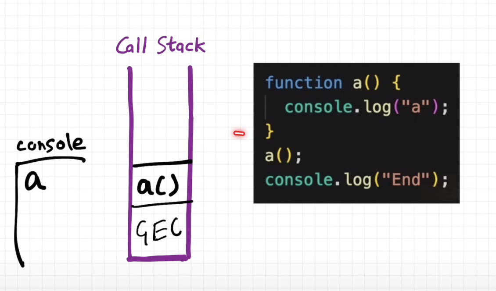

# iterators:
```js
function* fibonacci() {
  let current = 1;
  let next = 1;
  while (true) {
    yield current;
    [current, next] = [next, current + next];
  }
}

const seq = fibonacci();
const firstThreeDigitTerm = seq.find((n) => n >= 100);
```
You cannot convert seq to an array, because it is infinite. Instead, you can use the find() method of the iterator itself, which only iterates seq as far as necessary to find the first value that satisfies the condition.

# promise
- A Promise is an object representing the eventual completion or failure of an asynchronous operation.
- Essentially, a promise is a returned object to which you attach callbacks, instead of passing callbacks into a function.
## chaining:
- A common need is to execute two or more asynchronous operations back to back, where each subsequent operation starts when the previous operation succeeds, with the result from the previous step.
## error handling based on importance of any intermediate operations in the chain:
```js
doSomethingCritical()
  .then((result) =>
    doSomethingOptional(result)
      .then((optionalResult) => doSomethingExtraNice(optionalResult))
      .catch((e) => {}),
  ) // Ignore if optional stuff fails; proceed.
  .then(() => moreCriticalStuff())
  .catch((e) => console.error(`Critical failure: ${e.message}`));
```
- The inner error-silencing catch handler only catches failures from `doSomethingOptional()` and `doSomethingExtraNice()`, after which the code resumes with `moreCriticalStuff()`. Importantly, if `doSomethingCritical()` fails, its error is caught by the final (outer) catch only, and does not get swallowed by the inner catch handler.
- In async/await, this code looks like:
```js
async function main() {
  try {
    const result = await doSomethingCritical();
    try {
      const optionalResult = await doSomethingOptional(result);
      await doSomethingExtraNice(optionalResult);
    } catch (e) {
      // Ignore failures in optional steps and proceed.
    }
    await moreCriticalStuff();
  } catch (e) {
    console.error(`Critical failure: ${e.message}`);
  }
}
```
- Note: If you don't have sophisticated error handling, you very likely don't need nested then handlers. Instead, use a flat chain and put the error handling logic at the end.

## Promise rejection events
If a promise rejection event is not handled by any handler, it bubbles to the top of the call stack, and the host needs to surface it. On the web, whenever a promise is rejected, one of two events is sent to the global scope. The two events are:
`unhandledrejection` - Sent when a promise is rejected but there is no rejection handler available.
`rejectionhandled` - Sent when a handler is attached to a rejected promise that has already caused an unhandledrejection event.
- How to handle unhandledrejection event in window object in the browser
```js
addEventListener("unhandledrejection", (event) => {});
onunhandledrejection = (event) => {};  // event has two properties, reason and promise
```
Example:
```js
window.addEventListener("unhandledrejection", (event) => {
  console.warn(`UNHANDLED PROMISE REJECTION: ${event.reason}`);
});
```
- how to handle in node.js:
In Node.js, handling promise rejection is slightly different. You capture unhandled rejections by adding a handler for the Node.js unhandledRejection event (notice the difference in capitalization of the name), like this:

```js
process.on("unhandledRejection", (reason, promise) => {
  // Add code here to examine the "promise" and "reason" values
});
```
Example:
```js
function doSomething() {
    return new Promise((resolve) => {
      setTimeout(() => {
        // Other things to do before completion of the promise
        console.log("Did something");
        // The fulfillment value of the promise
        resolve("https://example.com/");
      }, 200);
    });
  }
  

doSomething()
  .then(() => {
    throw new Error("Something failed");

    console.log("Do this");
  })
//   .catch((err) => {
//     console.error(err, "\nDo that");
//   })
  .then(() => {
    console.log("Do this, no matter what happened before");
  });


  process.on("unhandledRejection", (reason, promise) => {
    // Add code here to examine the "promise" and "reason" values
    console.log(reason)
    console.log(promise)
  });
```
- For Node.js, to prevent the error from being logged to the console (the default action that would otherwise occur), adding that process.on() listener is all that's necessary.
## Composition
There are four composition tools for running asynchronous operations concurrently: `Promise.all()`, `Promise.allSettled()`, `Promise.any()`, and `Promise.race()`.


# Async JS & Event Loop:
- js is a single threaded, non blocking, asynchronous lang.
- it has one call stack and it can only do one thing at a time
- this call stack along with the heap make up the js engine - `V8`
## how is any js code run
- at the beginning when the engine starts, the global exec context(GEC) is initialized and pushed to the call stack, something like `main()`
- then the script is executed line by line, first we encounter a func declaration `function a(){...}` so the function is allocated memory and the function is stored
- next we encounter the func invocation `a()`, for this an exec context is created for function a and is pushed on the call stack, executes it and pops it, and so on.

- when the script is finished and the nothing more is to be executed the GEC is popped and the engine stops.
- The call stack doesn't wait for anything, whatever is pushed on it gets executed and popped, which can make js to be non blocking in the case of long computations such as bogo sort or some asynchronous operation like http req. so to make js non blocking, additional computation is done outside the `V8` engine to handle long running or blocking tasks in js

# points gathered
- `setTimeout()` is not a guranteed time of execution its a minimum time to execution.