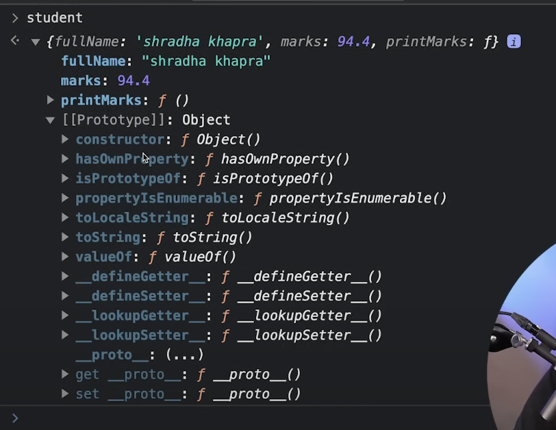
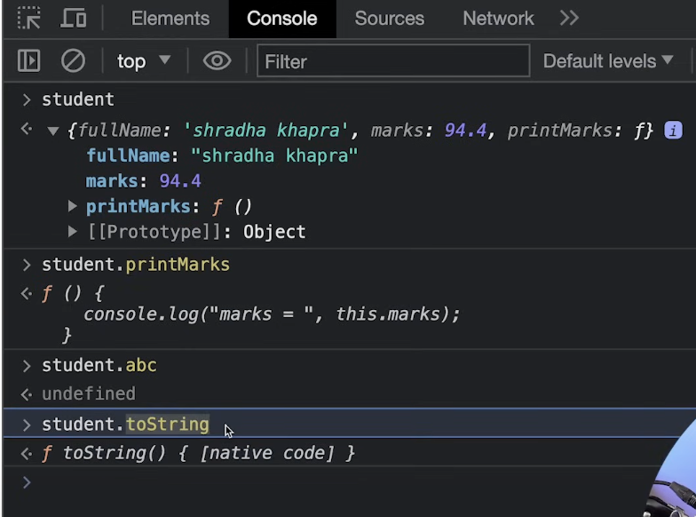
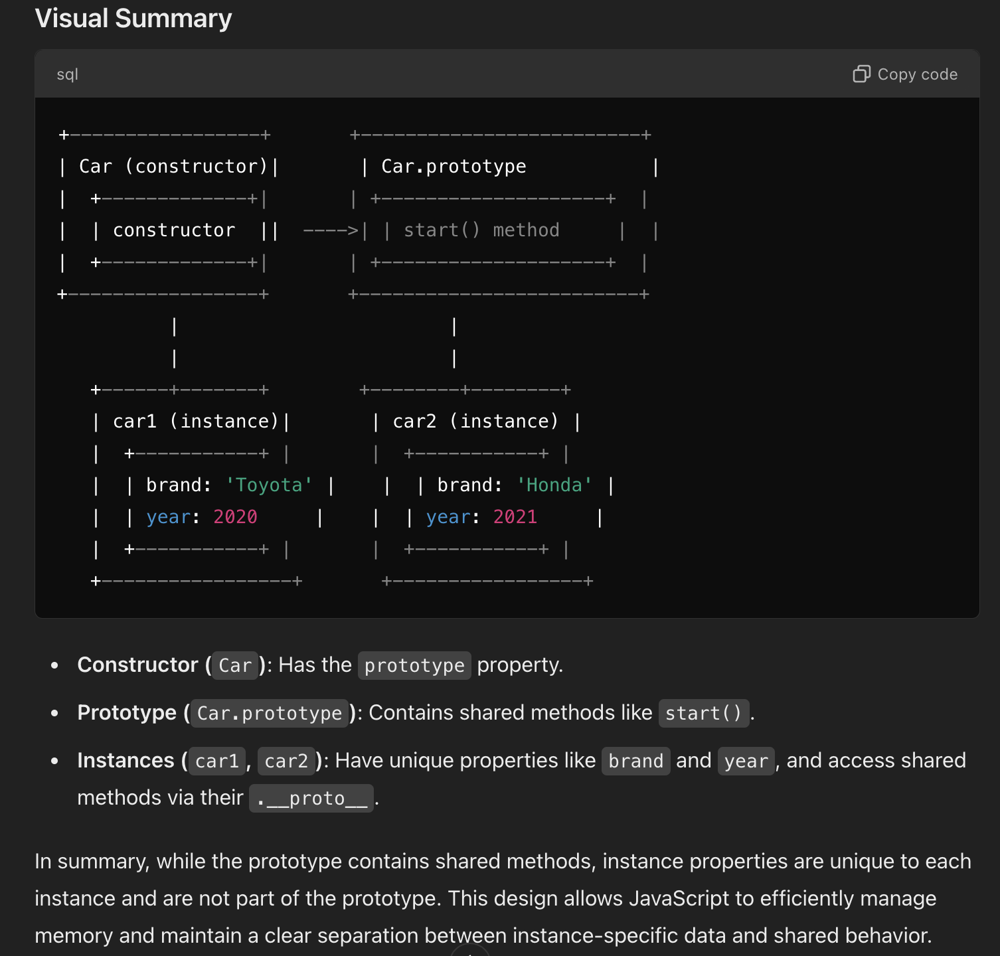

# Key concepts and differences in JS (compared to C++, Python, Java):

- > ## Dynamic Typing:
    - Variables can hold values of any type without explicit type declarations.
    - Type Coercion
- > ## First-class functions:
    - > ### Functions as Objects: 
        - Functions in JavaScript are first-class citizens, meaning they can be assigned to variables, passed as arguments, and returned from other functions. This allows for powerful functional programming patterns.
    - > ### Closures:
        - A closure is the combination of a function bundled together (enclosed) with references to its surrounding state (the lexical environment). In other words, a closure gives a function access to its outer scope.
        - This is a fundamental concept, especially for asynchronous programming.


# Syntax

> ## Loops:
For and while are same as c++
> ### `for`:
```js
for (let i = 0; i < 5; i++) {
  console.log(i);  // Outputs: 0, 1, 2, 3, 4
}
```
> ### `while`:
```js
let i = 0;
while (i < 5) {
  console.log(i);  // Outputs: 0, 1, 2, 3, 4
  i++;
}
```

> ### `for in`: to iterate over enumerable properties of an object
```js
for (let key in object) {
  // Code to execute for each property
}

const person = { name: 'Alice', age: 25 };

for (let key in person) {
  console.log(key, person[key]);  // Outputs: name Alice, age 25
}
```

> ### `for of`: to loop iterable objects like arrays, strings, maps,
```js
for (let value of iterable) {
  // Code to execute for each value
}

const array = [1, 2, 3, 4, 5];

for (let value of array) {
  console.log(value);  // Outputs: 1, 2, 3, 4, 5
}
```

# `var`, `let` and `const`
> ## `var`
- function-scoped: if its defined anywhere in the global space, then it is immediately hoisted and is available everywhere in the global scope, otherwise if its defined in a function then its only accessible within that function
- hoisted, meaning you can use them before the declaration line, but they are initialized to `undefined`

> ## `let`
- block scoped, not accessable outside the block
- not hoisted

> ## `var` v/s let or const, Basic difference:
these are the two fundamentally basic differences:
1. if you define a variable using let or const inside any if block, then it won't be available outside the block, but if you use var inside an if block, then it will be available everywhere inside the current function (by default we can consider the global scope as a main function of sorts)
2. var is hoisted and initialized wth `undefined` and let/const are not hosited, they are not initialized and TDZ applies to them (Temporal Dead Zone, that is while they are hoisted they cannot be accessed or initialized before the declaration statement.) 

Note:
- avoid var, prefer let and const
- const objects and arrays can still have their contents modified.

# data types
> ## primitve
- Number, String, Boolean, null, undefined, Symbol, and BigInt.
- no `char` type, use String
> ## non-primitive:
- Non-primitive types: Objects (arrays, functions, etc.).

```js
let num = 42;            // Number
let str = "Hello";       // String
let bool = true;         // Boolean
let arr = [1, 2, 3];     // Array (an object)
let obj = { key: 'val' };// Object
```
# ⭐️ loose equality `==` versus strict equality `===`
- Use === (strict equality): Avoids type coercion (e.g., 2 == "2" is true, but 2 === "2" is false).

# conditional statements:
- if else syntax is same
- below is `switch`:
```js
switch (x) {
  case 1:
    console.log("One");
    break;
  case 2:
    console.log("Two");
    break;
  default:
    console.log("Other");
}
```
⭐️ Note: Always include break to avoid fall-through behavior in switch statements.

# Functions:
> ## Function Declaration
```js
function greet(name) {
  return `Hello, ${name}`;
}
```
> ## Function Expressions (Anonymous Functions)
```js
const add = function(a, b) {
  return a + b;
};
```
> ## Arrow Functions (ES6+)
```js
const multiply = (a, b) => a * b;  // Concise syntax
```
> ## default params:
```js
function greet(name = "World") {
  return `Hello, ${name}`;
}
```


# ⭐️ Objects / Dicts:
```js
let person = {
    name: "John",
    age: 30,
    greet: function() {
      console.log(`Hello, I'm ${this.gender}`);
    },
    gender: 'M'
  };
  
person.greet();
  ```
- > ### Dot notation: `person.name`
- > ### Bracket notation: `person['name']`

> ## Destructuring:
```js
let { name, age } = person;
console.log(name, age);
```

> ## Arrays:
```js
let arr = [1, 2, 3];
arr.push(4);  // Adds to end
arr.pop();    // Removes last element
mapped_array = arr.map(x => x * 2);        // [2, 4, 6] (maps to new array)
filtered_array = arr.filter(x => x > 1);     // [2, 3] (filters array)
sum = arr.reduce((a, b) => a + b);  // 6 (reduces to single value)

arr = [1, 2, 'bird']    // can have different data types
console.log(typeof arr);  // object
```
We can also do this:
```js
let a = [1,2];
a[5] = 3;
console.log(a);
```
The values in the middle will get initialized with undefined

> ## string interpolation:
```js
let name = "John";
let greeting = `Hello, ${name}!`;
```

# Strict mode:
- jUse "use strict"; at the top of your JS file or function to enforce stricter parsing rules.
```js
"use strict";
x = 10;  // Throws an error because x is not declared
```

# Arrow Functions Have No this Context
In JavaScript, the `this` keyword refers to the current execution context (i.e., the object to which the function belongs). However, in traditional functions, the value of this can be tricky, especially in callbacks and asynchronous code because this can change based on how the function is called.

Arrow functions, on the other hand, do not have their own this context. Instead, they inherit this from the surrounding scope (i.e., the scope in which the arrow function is defined). This behavior is called lexical scoping of this.

Why Is This Useful?
In traditional functions, this can behave unpredictably inside callbacks, and we often need to use hacks like .bind(this) to ensure this refers to the correct object. But with arrow functions, since this is lexically bound, it always refers to the outer scope's this, making it easier to work with asynchronous code or callbacks.

See the below example,
without arrow functions we need to bind the surrounding context to current context:
```js
function Person(name) {
  this.name = name;

  setTimeout(function() {
    console.log(this.name);
  }.bind(this), 1000);  // Manually binding `this` to the outer context
}

const person = new Person('Alice');
// Output: Alice
```
But with arrow functions its much simpler:
```js
function Person(name) {
  this.name = name;

  setTimeout(() => {
    console.log(this.name);  // Arrow function doesn't create its own `this`, it uses the outer `this`.
  }, 1000);
}

const person = new Person('Alice');
// Output: Alice
```
Summary: `this` is lexical and refers to the context in which the arrow function was defined. This is especially useful in callbacks and asynchronous code where you want to maintain the value of this from the outer scope.

# `null` keyword:
- **Definition**: `null` is a special value in JavaScript that represents the intentional absence of any object value. It is a primitive value and is often used to indicate that a variable has been explicitly set to have no value.
- **Type**: When you check the type of `null` using `typeof`, it will return "object". This is considered a quirk of JavaScript.
```javascript
console.log(typeof null); // "object"
```
- **Usage**: It is commonly used to indicate that a variable should be empty or not point to any object.

# `undefined` keyword:
- **Definition**: undefined is a primitive value automatically assigned to variables that have been declared but not initialized. It also signifies that a property does not exist on an object.
- **Type**: When you check the type of undefined, it will return "undefined".
```javascript
let x;
console.log(typeof x); // "undefined"
```
- **Usage**: It is used by JavaScript to denote that a variable or property has not been assigned a value or does not exist.

# Sumamry: Difference between null and undefined:

- Intent: null is explicitly assigned to a variable to indicate that it has no value, while undefined is automatically assigned by JavaScript when a variable is declared but not initialized.
- Type: null has a type of "object", whereas undefined has a type of "undefined".
- Use Cases: You typically use null to represent the absence of a value where you expect a value, and undefined to represent uninitialized variables or non-existent properties.

# Data types:
> ## Number
- very large range
- used for both int and float values
- with float has precision upto 15-17 decimals.
- `Infinity` &  `-Infinity`:
```js
let posInf = Infinity;
let negInf = -Infinity;
```
- `NaN`:
```js
let parsed = Number('abc');
console.log(parsed); // Output: NaN

let result = 0 / 0;
console.log(result); // Output: NaN

// Checking for NaN
console.log(Number.isNaN(result)); // Output: true
```
> ## BigInt:
- for numbers outside Number range
- For integers larger than Number.MAX_SAFE_INTEGER (2^53 - 1), use BigInt.
- initialization: use n at the end:
```js
let bigInt = 123456789012345678901234567890n;
console.log(bigInt); // 123456789012345678901234567890n
```

# `String`:
- Immutable
- use '' or "" or `` to initialize
```js
let str1 = 'Hello';
let str2 = "World";
let str3 = `Hello, ${str2}`;
console.log(str3); // Output: Hello, World

let length = str1.length; // Length of the string
console.log(length); // Output: 5

let upperStr = str1.toUpperCase(); // Convert to uppercase
console.log(upperStr); // Output: HELLO
```

# `Boolean`:
- Falsy Values: 0, -0, NaN, null, undefined, '' (empty string), and false are considered falsy.
```js
let isTrue = true;
let isFalse = false;
```
# `Number`:


# Useful methods:
> ## Array Methods:
> ### 1. `forEach()`
```js
[1, 2, 3].forEach(num => console.log(num));
// Output: 1 2 3
```
> ### 2. `map()`:
```js
const doubled = [1, 2, 3].map(num => num * 2);
console.log(doubled);  // [2, 4, 6]
```
> ### 3. `ƒilter()`:
```js
const evens = [1, 2, 3, 4].filter(num => num % 2 === 0);
console.log(evens);  // [2, 4]
```
> ### 4. `reduce()`:
```js
const sum = [1, 2, 3].reduce((acc, num) => acc + num, 0);
console.log(sum);  // 6
```
Also `reduceRight()`: The reduceRight() method processes the array from right to left, accumulating a result. Could be useful in finding the minimum value from right or from left or something like that `¯\_(ツ)_/¯`


> ### 5. `find()`: Returns the first element that satisfies a condition.

```js
const result = [1, 2, 3].find(num => num > 1);
console.log(result);  // 2
```

> ### 6. `findIndex()`:
```js
const index = [1, 2, 3].findIndex(num => num > 1);
console.log(index);  // 1
```
> ### 7. `some()`:
```js
const hasEven = [1, 3, 5].some(num => num % 2 === 0);
console.log(hasEven);  // false
```
> ### 8. `every()`:
```js
const allPositive = [1, 2, 3].every(num => num > 0);
console.log(allPositive);  // true
```
> ### 9. `includes()`:
```js
const hasTwo = [1, 2, 3].includes(2);
console.log(hasTwo);  // true
```
> ### 10. `concats()`: join two or more arrays
```js
const combined = [1, 2].concat([3, 4]);
console.log(combined);  // [1, 2, 3, 4]
```

> ### 11. `slice()`: Returns a shallow copy of a portion of the array (non-destructive).
- In JS, the terms destructive and non-destructive are used to describe whether a method or operation modifies the original data structure (like an array) or not.
- Destructive (Mutating) Methods and Non-Destructive (Non-Mutating) Methods
- Destructive methods modify the original array directly.
- Non-destructive methods do not alter the original array but instead return a new array or value.
```js
const part = [1, 2, 3, 4].slice(1, 3);
console.log(part);  // [2, 3]
```
> ### 12. `splice()`: Adds/removes elements from an array (destructive).
`splice(startIndex, deleteCount, item1, item2, ...)`
```js
const arr = [1, 2, 4, 5];

// Add elements 3 and 6 at index 2
arr.splice(2, 0, 3, 6);

console.log(arr); // Output: [1, 2, 3, 6, 4, 5]
```
```js
const arr = [1, 2, 3];
arr.splice(1, 1);  // Removes one element at index 1
console.log(arr);  // [1, 3]
```
> ### 13. `sort()`: sorts the array *inplace* ⭐️
- Comparison Function: The function provided to sort() should return a negative number if the first argument should come before the second, a positive number if the second should come before the first, and 0 if they are equal.
- In-Place Sorting: The sort() method sorts the array in place and returns the sorted array.
- Stability: JavaScript’s Array.prototype.sort() is stable in modern engines, meaning it maintains the relative order of elements with equal sort keys.

```js
const arr = [1, 2, 3];
arr.splice(1, 1);  // Removes one element at index 1
console.log(arr);  // [1, 3]
```
> ### ⭐️ Custom sort:
```js
let listOfTuples = [
  [1, 2, 9, -2],
  [3, 4, 3]
];

// Function to calculate the average of a tuple
function calculateAverage(tuple) {
  const sum = tuple.reduce((acc, value) => acc + value, 0);
  return sum / tuple.length;
}

// Custom sort function to sort based on average value
listOfTuples.sort((a, b) => {
  const avgA = calculateAverage(a);
  const avgB = calculateAverage(b);

  // Return a negative number if a should come before b, positive if b should come before a, 0 if they are equal
  return avgA - avgB;
});

console.log(listOfTuples);
// Output: [ [3, 4, 3], [1, 2, 9] ]
```

> ### 14. `reverse()`: reverses the array in place.
```js
const arr = [1, 2, 3];
arr.reverse();
console.log(arr);  // [3, 2, 1]
```

> ## `String` Methods:
```js

// split()
// Splits a string into an array of substrings.
const parts = 'a,b,c'.split(',');
console.log(parts);  // ['a', 'b', 'c']

// join()
// Joins all array elements into a string.
const str = ['a', 'b', 'c'].join('-');
console.log(str);  // 'a-b-c'

// toUpperCase()
// Converts a string to uppercase.
console.log('hello'.toUpperCase());  // 'HELLO'

// toLowerCase()
// Converts a string to lowercase.
console.log('HELLO'.toLowerCase());  // 'hello'

// trim()
// Removes whitespace from both sides of a string.
console.log('  hello  '.trim());  // 'hello'

// replace()
// Replaces occurrences of a substring.
const str = 'Hello, World!'.replace('World', 'JS');
console.log(str);  // 'Hello, JS!'

// substring()
// Returns a portion of the string.
const str = 'abcdef';
console.log(str.substring(1, 4));  // 'bcd'

// charAt()
// Returns the character at the specified index.
console.log('hello'.charAt(1));  // 'e'

// startsWith() & endsWith()
// Checks if a string starts or ends with a specific substring.
console.log('hello'.startsWith('he'));  // true
console.log('hello'.endsWith('lo'));  // true
```
> ## `Object` Methods:
```js

// Object.freeze()
// Freezes an object, preventing modifications.

const obj = Object.freeze({ a: 1 });
obj.a = 2;  // No effect, object is frozen
```

> ## Misc. Methods/Functions:
```js
-> setTimeout()
// Executes a function after a specified delay.

setTimeout(() => console.log('Hello'), 1000);  // Executes after 1 second


-> setInterval()
// Repeatedly calls a function at specified intervals.

const intervalId = setInterval(() => console.log('Tick'), 1000);
// To clear the interval: clearInterval(intervalId);


-> parseInt() & parseFloat()
// Converts a string to an integer or floating-point number.

const num = parseInt('42'); 
const floatNum = parseFloat('3.14');


-> JSON.stringify() & JSON.parse() = Converts an object to JSON and vice versa.

  const obj = { a: 1, b: 2 };
  const json = JSON.stringify(obj);
  const parsedObj = JSON.parse(json);

-> Math.random() = Returns a random number between 0 and 1.

  const rand = Math.random();  // e.g., 0.123456


-> Math.floor(), Math.ceil(), Math.round() = Rounds numbers down, up, or to the nearest integer.

  console.log(Math.floor(4.9));  // 4
  console.log(Math.ceil(4.1));   // 5
  console.log(Math.round(4.5));  //
```


```


```js
// stoi
let parsed = Number('43.21');

// to_string
let x = 2.35
print(typeof x.toString())
```

# Mutability
- Primitive Data Types (e.g., Number, String, Boolean, null, undefined, Symbol, BigInt) are immutable. This means their values cannot be changed after assignment.

```js
let a = "hello";
a[0] = "H";  // No effect, strings are immutable
a = "Hello";  // Reassigns the entire variable, creates a new string
```
- Objects and Arrays are mutable. This means their internal state (properties or elements) can be changed even if they are declared with const.

```js
const obj = { name: "Alice" };
obj.name = "Bob";  // Object is mutable, properties can be changed
```

# Data Structures:
> ## `Set`:
```js
const set = new Set([1, 2, 3]);
set.add(3);  // No effect, duplicates not allowed
set.delete(2);
console.log(set.has(1));  // true
```
- `add(value)`: Adds a value to the set.
- `delete(value)`: Removes a value.
- `has(value)`: Checks if a value exists.
-`size`: Returns the number of elements.
- `clear()`: Removes all elements.

> ## `Map`:
```js
const map = new Map();
map.set('name', 'Alice');
map.set(1, 'one');  // Keys can be numbers
console.log(map.get('name'));  // Alice
```

- `set(key, value)`: Adds a key-value pair.
- `get(key)`: Retrieves a value by key.
- `has(key)`: Checks if a key exists.
- `delete(key)`: Removes a key-value pair.
- `size`: Returns the number of elements.
- `.keys()`, `.values()`, `.entries()` - for iterations.
- `.clear()`
- `.forEach((value, key) => {...})`:
```js
map.forEach((value, key) => {
  console.log(`${key}: ${value}`);
});
```

# Map vs Object: Differences:

- Key Types:
    - Object: Keys are strings or Symbols.
    - Map: Keys can be any type (including objects and functions).
- Ordering:
    - Object: Does not guarantee order.
    - Map: Maintains insertion order.
- Prototype:
    - Object: Has a prototype chain.
    - Map: Does not have a prototype chain.
- Methods:
    - Object: Limited set of methods, not as flexible.
    - Map: Richer set of methods for operations and iterations.
- Performance:
    - Object: Can be slower for frequent additions and deletions.
    - Map: Generally faster for frequent additions and deletions and provides better performance for large collections of data.

⭐️ For Multiset just use Map as a counter
⭐️ Heaps don't exist, :) wtf


# `this` keyword:
- `this` refers to the current execution context

```js
const obj = {
  name: 'Alice',
  greet() {
    console.log(this.name);  // `this` refers to obj
  }
};
obj.greet();  // Output: Alice
```
- In Functions: this refers to the global object (window in browsers).
In Arrow Functions:

- Arrow functions don’t have their own `this`; they inherit it from the surrounding scope (lexical `this`).

⭐️ In strict mode, this in a standalone function is undefined.

# `try...catch...finally` Syntax
```js
try {
  // Code that might throw an error
} catch (error) {
  // Handle the error
} finally {
  // Code that always runs (optional)
}

try {
  let result = riskyOperation();
} catch (error) {
  console.error('An error occurred:', error.message);
} finally {
  console.log('Cleanup code runs here');
}
```
# Advanced Operators:
> ## Nullish Coalescing (??)
- Returns the right-hand operand if the left-hand operand is null or undefined.

```js
let x = null;
let result = x ?? 'default';  // 'default'
```

> ## Optional Chaining (?.)
- Safely access deeply nested properties. If a property is null or undefined, it returns undefined instead of throwing an error.

Example:

```js
let obj = { user: { name: 'Alice' } };
console.log(obj.user?.name);  // Alice
console.log(obj.user?.address?.city);  // undefined, no error
```

> ## Ternary Operator (?:)
```js
let isLoggedIn = true;
let greeting = isLoggedIn ? 'Welcome back!' : 'Please log in';
```

⭐️ null and undefined
- `null`: Explicit absence of value.
- `undefined`: Variable declared but not assigned.


# Other concepts:
> ## Closures:
A closure is a function that retains access to its lexical scope, even when the function is executed outside that scope. This is a powerful concept often used in callbacks, asynchronous code, and function factories.
```js
function outer() {
  let count = 0;
  return function inner() {
    count++;
    console.log(count);
  };
}
const increment = outer();
increment();  // 1
increment();  // 2
```
> ## Promises & Async/Await: 
Promises and async/await are essential for working with asynchronous operations. You probably touched on this with the this context explanation, but it's good to be aware of how Promises and async/await manage asynchronous control flow.
```js
const fetchData = async () => {
  try {
    const response = await fetch('https://api.example.com/data');
    const data = await response.json();
    console.log(data);
  } catch (error) {
    console.error('Error:', error);
  }
};
```
> ## 3. Modules (ES6 Modules)
ES6 modules allow you to split your code into multiple files and manage dependencies using import and export.

```js
-> Example of exporting:
// utils.js
export const add = (a, b) => a + b;
export const subtract = (a, b) => a - b;

-> Example of importing:
// main.js
import { add, subtract } from './utils.js';
console.log(add(5, 3));  // 8
```

> ## Prototype and Prototypal Inheritance
JavaScript uses prototypal inheritance, meaning objects can inherit properties from other objects through the prototype chain.
Prototype basics:

```js
function Person(name) {
  this.name = name;
}

Person.prototype.sayHello = function() {
  console.log('Hello, ' + this.name);
};

const alice = new Person('Alice');
alice.sayHello();  // Hello, Alice
```
Why it's useful: JavaScript doesn’t have classical inheritance like other languages (e.g., C++ or Java), so understanding prototypes is essential for mastering how inheritance works in JS.

> ## Class Syntax:
```js
class Animal {
  constructor(name) {
    this.name = name;
  }

  speak() {
    console.log(`${this.name} makes a sound.`);
  }
}

const dog = new Animal('Dog');
dog.speak();  // Dog makes a sound.
```
> ## Destructuring and Rest/Spread Operators
- Destructuring lets you easily extract values from arrays or objects.
```js
const [a, b] = [1, 2];
const { name, age } = { name: 'Alice', age: 25 };
```
- Rest/Spread (...): Useful for merging arrays/objects or gathering function arguments.
```js
const nums = [1, 2, 3];
const newNums = [...nums, 4, 5];  // [1, 2, 3, 4, 5]

⭐️ const sum = (...args) => args.reduce((acc, val) => acc + val, 0);
```
> ## Cool Tricks:
```js
-> IIFE (Immediately Invoked Function Expression):

(function() {
  console.log('This runs immediately!');
})();

Why it's useful: IIFEs are often used to create local scopes and avoid polluting the global namespace.


-> Short-circuit evaluation:

const result = a || b;  // Returns `a` if it's truthy, otherwise returns `b`
const valid = isUser && isAdmin;  // Returns `true` only if both conditions are true


-> Default Parameters:
You can set default parameter values in functions.

function greet(name = 'Guest') {
  console.log(`Hello, ${name}`);
}
greet();  // Hello, Guest
```

> ## `Array.prototype.flatMap()`
- The flatMap() method maps each element using a mapping function and then flattens the result into a new array.

Example:

```javascript
const arr = [1, 2, 3];

// Map each number to an array of its number and its square, then flatten the result
const result = arr.flatMap(num => [num, num * num]);

console.log(result); // Output: [1, 1, 2, 4, 3, 9]
```
- Explanation: `flatMap(callbackFn)` applies `callbackFn` to each element and flattens the result by one level.


# Building Foundations: Asynchronous JS
> ## JS's single-threaded nature

- A thread is a single sequence of execution in a program.
- JS is single threaded meaning it can only execute one piece of code at a time unlike c++ or python which can be multithreaded, this might give the indication that JS is less capable but JS handles concurrency in a very unique way, using non-blocking asynchronous mechanisms.
- Synchronous vs Asynchronous ops:
  - sync ops are those where tasks are executed one after another in a sequence, and each task waits for the previous one's execution to complete.
  - In c++, python or java calling a function blocks the program untill the function returns, but in js certain tasks are allowed to happen in the background instead of waiting for them to finish js can start other tasks in the meantime.
  example:
  ```js
  console.log('start');
  setTimeout(() => {console.log('finished async task')}, 1000);
  console.log('end')
  ```
- > ## `Key Takeaway:` JavaScript is single-threaded, but it can handle asynchronous operations efficiently by delegating tasks and using its event loop.

> ## 2. Event Loop and Call Stack
> ### Call Stack: 
- The call stack is a data structure used to keep track of function calls in JavaScript. When you call a function, it gets pushed onto the stack. Once the function finishes, it gets popped off.

- This is how synchronous code is executed in a single-threaded manner.
> ### Event Loop:
- The event loop is the mechanism that enables asynchronous code execution in JavaScript.
- When an asynchronous operation (like a network request, timer, or file reading) is made, it is offloaded to the browser's **Web APIs or Node.js APIs**, which handle the operation. These are non-blocking and allow the main thread (call stack) to continue executing.
- Once the asynchronous task is complete (e.g., a response from a server), the event loop checks if the call stack is empty. If it is, the task's callback function gets placed in the callback queue and executed.

> ## Callbacks
- A callback is a function passed as an argument to another function, to be executed later, usually when an asynchronous operation completes.
- Callbacks were the original way to handle asynchronous tasks in JavaScript.
```js
function getData(callback) {
  setTimeout(() => {
    console.log('Fetching Data...');
    callback('Data Received');
  }, 1000);
}

getData((message) => {
  console.log(message);  // Output: Data Received (after 1 second)
});
```
> ### Why Use Callbacks?

- Callbacks allow us to wait for asynchronous tasks without blocking the rest of the program.
- However, callbacks can lead to callback hell, a scenario where nested callbacks make the code hard to read and maintain.

> ## 4. Promises
> ### What is a Promise?
- A Promise is a modern and cleaner way to handle asynchronous operations. It represents a value that may be available <span style="color:cyan;">now</span>, in the <span style="color:cyan;">future</span>, or <span style="color:cyan;">never</span>.

- Promises have three states:
  - Pending: Initial state, neither fulfilled nor rejected.
  - Fulfilled: Operation completed successfully.
  - Rejected: Operation failed.

⭐️ Promises are asynchronous by nature, but they do not execute immediately. They run after the current synchronous code completes (via the event loop).

> ## Async/Await
- What is `async/await`?
  - `async`/`await` is syntactic sugar introduced in ES2017 (ES8) to write asynchronous code that looks synchronous.
  - async functions return a Promise, and await pauses the execution of the function until the Promise is resolved or rejected.

# OOP

<!-- - https://www.youtube.com/watch?v=N-O4w6PynGY&list=PLGjplNEQ1it_oTvuLRNqXfz_v_0pq6unW&index=13 -->

> ## Prototypes in JS
- A js object is an entity having state and behavior (properties and methods).
- every obj in js has an automatically created special inbuilt property.
- 
- here Prototype is in itself an object with several properties
- for example:

  - here we didnt define student.abc so its undefined, similarly we didn't define toString() method but its there, thats because its inherited from the Prototype object.
- js objects have a by default special property called prototype which has some special properties and methods.
> ### Practical implementation
- we can make our own prototypes:
```js
const employee = {
  calcTax() {
    console.log('tax is 10%');
  },
};

const arjun = {
  salary: '50k'
};

⭐️ now if we want to access the properties and methods of the employee object in the arjun object then we can write employee as a prototype for arjun:
arjun.__proto__ = employee;
arjun.calcTax();
```
- js objects's special property `prototype`'s type is that its a reference to an Object or its `null`. basically its the reference or address of the parent object, like we're accessing the parent through the child
- methods overriding, we can implement the methods again in the child which would take precedence over the the prototype's implementation

> ## Classes in js
- Class is a program-code template for creating objects
```js
class MyClass{
  constructor() {
    this.x = x;
    ...
  }

  myMethod() {
    ...
  }
}
let myObj = new MyClass();
```
> ### Constructor Method
`constructor()` - either you define it, or js will define it implicitly

> ## more oops
consider this example:
```js
"use strict";

function Fruit() {
  this.color = 'red';
  this.greet = function() {
    console.log('greetings');
  }
}

Fruit.prototype.info = function() {
  console.log(`This fruit is ${this.color}.`);
}

const apple = new Fruit();

console.log(apple);

apple.info();
apple.greet();

console.log(typeof Fruit)
```

> ## Limiting the flexibility and freedom to change property of js objects:
- JavaScript objects are inherently flexible, and by default, you can add and remove properties at any time. However, you can use some techniques to limit this behavior:
> ### 1. `Object.freeze()`: Prevents adding, removing, or modifying properties.
```js
class Car {
  constructor(brand, isFast = false) {
    this.brand = brand;
    this.isFast = isFast;
  }
}

const lambo = new Car('Lamborghini');
Object.freeze(lambo);

lambo.topSpeed = '400mph'; // This will not work
console.log(lambo.topSpeed); // undefined
```
> ### 2. `Object.seal()`: Prevents adding or removing properties but allows modification of existing properties.

```js
class Car {
  constructor(brand, isFast = false) {
    this.brand = brand;
    this.isFast = isFast;
  }
}

const lambo = new Car('Lamborghini');
Object.seal(lambo);

lambo.topSpeed = '400mph'; // This will not work
lambo.isFast = true; // This will work
console.log(lambo.topSpeed); // undefined
```

> ## Inheritance
- passing down properties and methods from parent class to child class
- done using `extends` keyword
```js
class Parent {

}
class Child extends Parent {

}
```
- method overriding is there

> ## `super` keyword:
- the 'super' keyword is used to call the constructor of its parent class to access the parent's properties and methods.
```js
super(args) // calls Parent's constructor
super.parentMethod(args)  // calls parentMethod which is defined in the parent
```
> key points:
- first of all, to initialize a child's object you must call the parent class's constructor in the child constructor, this is done by: `super(args)`
- next if you want to access anything of the parent class then you need to do it through super.parentProperty, the parent's props and methods are not available directly in the object


# OOP key insights:
> ## related to Classes:
- `constructor`: This is a special method that is automatically called when a new object is instantiated using new. It’s similar to the constructors in C++ or Python.
- An instance's `.__proto__` (or `Object.getPrototypeOf(instance)`) points to the constructor's prototype obj. This prototype object contains methods but does not include instance-specific properties.
> Nuances:
- JavaScript doesn't have true classes like C++ or Java. Classes in JS are just functions under the hood and follow prototypal inheritance.
- `this` behavior: Inside methods, this refers to the instance. Be mindful of losing the `this` context when passing class methods as callbacks or event listeners (more on that later).
> ## related to Inheritance:
- `extends`: Establishes inheritance.
- `super()`: Calls the parent class constructor. Must be called before accessing this in the child constructor.
- If no constructor is provided in the child class, JavaScript automatically calls `super()` with the same arguments as the parent constructor.
>Nuances
- Method Overriding: Child classes can override parent class methods, but calling super.methodName() allows access to the parent’s implementation.

> ## getters and setters in js, to define controlled access
- see the example in examples dir, dont spend too much time
> ## Truly private fields for Stronger encapsulation:
- Private fields and methods are prefixed with # and are truly inaccessible from outside the class.
- they can only be accessed within the class using `this.#property` or `this.#method()` syntax
- Unlike "pseudo-private" fields using underscores (_property), #privateFields cannot be accessed or modified from outside the class. This adds stronger encapsulation.

```js
class Car {
  constructor(speed) {
    this.#speed = speed;
  }
  #speed;

  #explode = () => {
    console.log('kaboom 💥');
  }

  accelerate() {
    this.#speed += 10;
    console.log(`Speed: ${this.#speed}`);
    if(this.#speed > 35) {
      this.#explode();
    }
  }
}

const myCar = new Car(5);
myCar.accelerate();  // Output: Speed: 15
myCar.accelerate();  // Output: Speed: 25
myCar.accelerate();  // Output: Speed: 35
myCar.accelerate();  // Output: Speed: 45, hence 💥
// console.log(myCar.#speed);  // Error: Private field '#speed' must be declared in an enclosing class
// Output:
// Speed: 15
// Speed: 25
// Speed: 35
// Speed: 45
// kaboom 💥
```
> ## Static Methods & Properties
- Static members are shared by all instances of the class, and they’re accessed on the class itself, not on individual objects.
- use `static` keyword within the class definition
```js
class MathUtils {
  static pi = 3.14159;

  static calculateCircumference(radius) {
    return 2 * MathUtils.pi * radius;
  }
}

console.log(MathUtils.pi);  // Output: 3.14159
console.log(MathUtils.calculateCircumference(5));  // Output: 31.4159
```
> key point(s):
Static methods/properties are accessed via the class name, cannot be accessed via the instance.

> ## Prototypal Inheritance (Under the Hood)
Even though modern JavaScript uses the class syntax, it’s still based on prototypal inheritance. This means that every object has a prototype from which it can inherit methods.



```js
Copy code
function Animal(name) {
  this.name = name;
}

Animal.prototype.speak = function() {
  console.log(`${this.name} makes a sound.`);
};

const dog = new Animal('Dog');
dog.speak();  // Output: Dog makes a sound.
```
> Key Points:
- Prototypes are objects that act as a blueprint for other objects.
- Every function in JavaScript has a prototype property, which can be used to add shared methods.
- While class makes syntax clearer, understanding prototype chaining is essential for debugging or advanced use-cases.
- `Object.create()` is another way to create objects that explicitly set the prototype.
```js
const personPrototype = {
  greet() {
    console.log('Hello!');
  },
  introduce() {
    console.log(`Hi, I'm ${this.name}`);
  }
};
// Create a new person like this from the prototype
const person = Object.create(personPrototype);
person.name = 'Alice';

// or like this from another object as a link/hook
const person2 = Object.create(Object.getPrototypeOf(person));
```
> ## `this` in OOP
The `this` keyword can be tricky in JavaScript, especially inside callbacks or event listeners.

`this` in Methods:
- Inside the class definition, `this` refers to the instance of the class.
consider this code:
```js
"use strict";

class Person {
  constructor(name) {
    this.name = name;
  }
  eat() {
    console.log(`${this.name} is eating.`);
  }
}

const tom = new Person('tom');
tom.eat();

setTimeout(tom.eat, 1000);
```
> output: 
```
tom is eating.
undefined is eating.
```


> ### Constructor Functions
- In JavaScript, you can create objects using constructor functions (like `Fruit`).
When called with `new`, the constructor function creates a new object, sets up `this` to refer to the new object, and assigns properties to it.
> ### Prototype
- Every function in JavaScript has a special property called `prototype`, which is an object. This prototype is shared by all instances created by that function (like all `Fruit` objects).
Properties or methods added to the prototype are shared by all instances, reducing memory usage (since the method is only stored once).
> ### Prototypal Inheritance
- When an object accesses a property or method that it doesn't have, JavaScript looks up the prototype chain to find it.
Objects in JavaScript inherit from other objects, not from classes, which is the essence of prototypal inheritance.

consider this code:
```js
"use strict";

function Person(name) {
  this.name = name;
}
Person.prototype.sayHello = function() {
  console.log(`Hello, ${this.name}`);
}
const alice = new Person('Alice');

alice.sayHello();
```

# To visualize the prototype chain, you can check it like this:

```js
console.log(alice.__proto__ === Person.prototype);  // true
console.log(Person.prototype.__proto__ === Object.prototype);  // true
console.log(Object.prototype.__proto__ === null);  // true
```
> ### ⭐️ This shows that alice's prototype is Person.prototype, which in turn inherits from Object.prototype. All objects in JavaScript ultimately inherit from Object.prototype.

> ## Class based syntax:
- In languages like C++, you define a class that represents a blueprint for objects. In JavaScript:

  - You can still use class-like syntax introduced in ES6, but it's just syntactic sugar over the prototype-based inheritance.

  - Here's how the above code would look like in class syntax:
```js
class Person {
  constructor(name) {
    this.name = name;
  }

  sayHello() {
    console.log('Hello, ' + this.name);
  }
}
const alice = new Person('Alice');
alice.sayHello();  // Hello, Alice
```
> ## Advantages of Prototypal Inheritance
- Memory efficiency: Methods like sayHello aren’t copied to each instance of Person (as they would be in class-based inheritance). Instead, all instances share the same method through the prototype.
- Flexibility: You can dynamically add methods or properties to an object’s prototype even after instances have been created.

# `prototype` vs `__proto__`
> ## `prototype`
- This is a property of the constructor function which is used to create objects of a class using the `new` keyword.
- It serves as a blueprint to all objects created by this constructor, properties and methods added to ConstructorFunction.prototype are available to all objects of that constructor.

> ## `__proto__`:
- This is a property of the object instances which point to the prototype object of the constructor function which created this obj.


# JS Tricks:
> ## Integer division:
> `(a/b >> 0)` or `(~~(a/b))` or `(a/b | 0)`