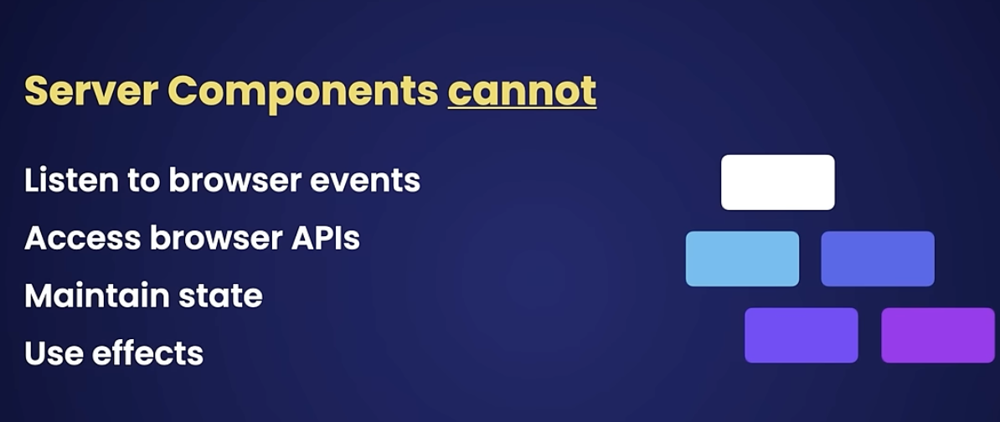
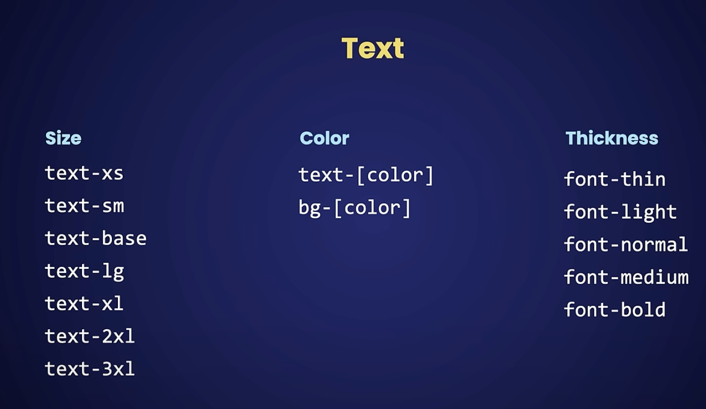

# nextjs
- a comprehensive framework built on react which allows full stack dev for fast and seo friendly apps, eg comes with an inbuilt router
- comes with a cli(to build and start apps), compiler(for transforming and minifying js code) and a node js runtime
- we can write both the front end and the back end code in the same project, the backend code gets executed in the nodejs runtime and the frontend code gets bundled and sent to the client for rendering, this is rendering our pages on the server and sending the contents to the client which is called server side rendering, which makes app fast and seo rendering.
- routing:
users page: app/users/page.tsx
api route: app/api/route.js
- navigation:
dont use <a>, use <Link href='/users'>go to users page</Link>
we're not redownloading a bunch of css, fonts, js files, we're just getting the static data, this is client side navigation.
- we have 2 environments where we can render our components and generate markup: client the web browser, and server, the node.js runtime
- csr:
    - large bundling: we have to bundle all our app code and send that to the client for rendering, as the app grows so does the bundle size, resource heavy
    - no seo, because search engine bots or crawlers which index our website cannot run js code so they can't read our website's data
    - less secure; any dependencies like api keys are exposed to the client
- ssr:
    - smaller bundles, only send the essential bundles when needed to the client
    - resource efficient for the client as the server does most of the rendering
    - seo, since rendering is done on the server and we send the actual content to the client
    - keep sensitive data like api keys on the server
    - BUT you lose interactivity

so in real world apps we use a mixture of ssr and csr, we should maximize ssr, and seperate out csr necessary portions into a seperate smaller component instead of making the entire comp csr.
- any csr that you write 'use client' will change the comps it depends on into csr

## fetching data:
- on the client: useState() + useEffect() or React Query (tanstack useQuery hook)
- on the ssr, like normal js, just use async await.

## static vs dynamic rendering for ssr:
- another optimization, if you have pages that have static data, nextjs can render them once, cache them and reuse them throughout the app, redering at build time
- on the other hand, dynamic rendering, render at request time,
example: const res = await fetch(url, { cache: 'no-store '});

- npm run dev - start the app in dev
- npm run build - build the app
- npm start - run the app in prod

## styling in nextjs
- global css for truly global css properties
- component specific css should be defined in the components folder with the name: ProductCard.module.css, inside which we can define classes without worrrying about class name clashes somewhere else in the code, then inside the component: `import styles from './ProductCard.module.css'`
- this will convert the .css of ProductCard.module.css into properties of styles obj, thats why we cannot use hyphens for class names in css file as these are not valid js object property (use camelCase), then do:
`
` if the class name inside ProductCard.module.css is cardBorder, in the final build the class attached to the html will have different name to prevent clashes due to a tool called postcss

## tailwind:
- paddings and margins trivial:
p-[number]
- text 
- hover:bg-sky-500