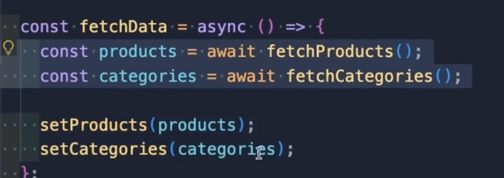
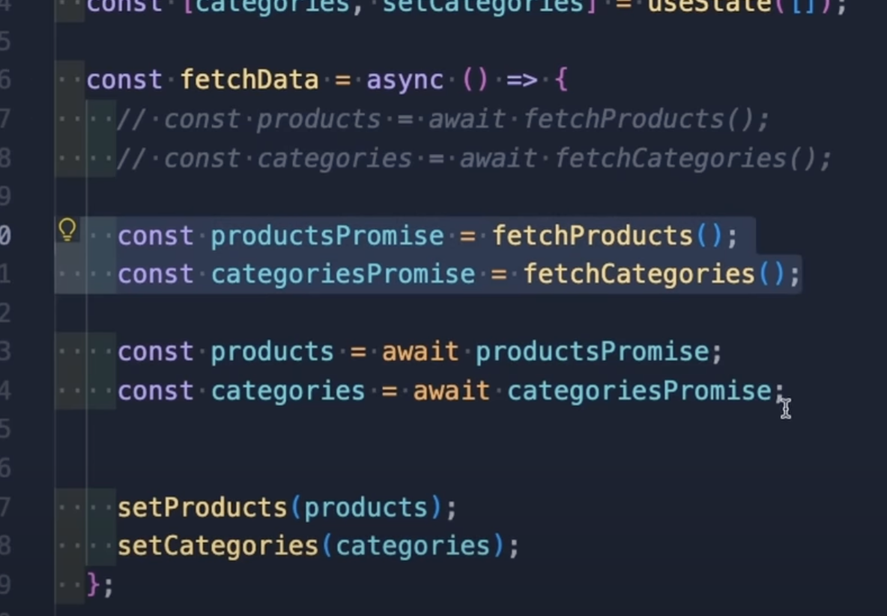

> to add a method to a class using the prototypal way:
```js
ClassName.prototype.myMethod = function () {}
```
> ways to check type of number:
```js
let parsed = Number('123');
const a = 54;

console.log(typeof a);
console.log(Number.isInteger(a))
```
> always use .get and .set methods with Map() in js
- Number.MAX_SAFE_INTEGER
- In JavaScript, functions are first-class objects,. Functions themselves are not a distinct data type; rather, they are a special type of object.
- `parseInt('str')` & `parseFloat('2.3')`

# new ones
- default sort on integers sorts them lexicographically instead of by value
- instead of awaiting each promise like this:

Waterfall overview of this way doing async requests:

do this instead for concurrent start to async operation:


OR

`const [products, categories] = await Promise.all([fetchProducts(), fetchCategories()])`
this has the following waterfall overview:
](image-14.png)

Note: this can only be done in case of independent promises (as might have been suggested by Promise.all())